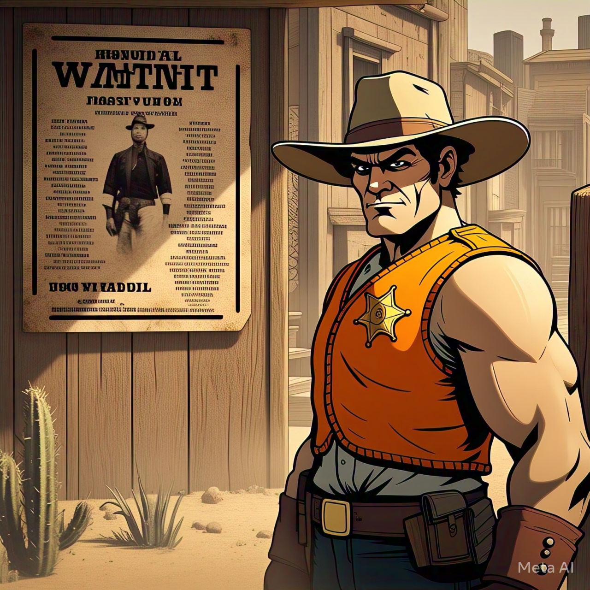

# Cazadores de Recompensas



El Jefe de una Agencia de Seguridad está abrumado por la cantidad de cazadores de recompensas que tiene bajo su mando y nos ha contratado para desarrollar un sistema que lo ayude a organizar sus operaciones, ya que, según sus propias palabras: **"esto es un caos total"**

Nos explica que hay distintos tipos de cazadores:

- **Cazadores Urbanos**: especialistas en entornos civiles.
- **Cazadores Rurales**: experto en zonas agrestes, rivales tradicionales de los urbanos.
- **Cazadores Sigilosos**: especializados en capturas discretas.

Y que de cada prófugo se sabe lo siguiente:

- **Un nivel de inocencia** es un valor que cuanto más bajo es, más culpable se lo considera.
- **Un nivel de habilidad** es un valor entre 1 y 100 que determina la capacidad de evadir la captura.
- Un atributo que indica si es **nervioso** o no.

La tarea principal de un Cazador de Recompensas es capturar prófugos.

## Parte I - El proceso de Captura

El Jefe de la Agencia envía a un cazador a una zona específica. La zona que tiene un nombre y un conjunto de prófugos que la habitan. Cuando un cazador realiza el proceso de captura en una zona, para cada prófugo de la misma pueden pasar dos cosas:

- Logra capturarlo.
- Falla en la captura, en cuyo caso el cazador lo intimida para facilitar futuros intentos.

### Condiciones de Captura

Para que un cazador pueda capturar a un prófugo, deben cumplirse 2 condiciones:

- **General**: La experiencia del cazador debe ser mayor que la inocencia del prófugo.
- **Espefifica** según el tipo de cazador:
  - **Cazador Sigiloso**: El nivel de habilidad del prófugo debe ser menor a 50.
  - **Cazador Rural**: El prófugo debe ser nervioso.
  - **Cazador Urbano**: El prófugo no debe ser nervioso.

Si un cazador no puede capturar al prófugo entonces al menos lo intimida.

### Consecuencias de la intimidación

- El nivel de inocencia del prófugo disminuye en 2 unidades (se lo considera más culpable y nunca puede ser negativa)
- Además, según el tipo de cazador:
  - **Cazador Urbano**: el prófugo deja de ser nervioso.
  - **Cazador Rural**: el prófugo se vuelve nervioso.
  - **Cazador Sigiloso** Reduce la habilidad en 5 unidades(nunca puede ser negativa) para facititar un futura captura.

### Sumar Experiencia

Finalmente, despues de un proceso de captura el cazador incrementa su experciencia por medio del siguiente cálculo:

```
    experiencia += (Mínimo valor de habilidad entre todos los intimidados ) + ( 2 * prófugos capturados)
```

### Requerimientos Parte I

- Hacer que un cazador realize el proceso de captura en una zona, capturando los prófugos que pueda e intimidando al resto. La zona debe quedar sin los prófugos capturados.

## Parte II - Los prófugos evolucionan

Los Prófugos pueden entrenarse para mejorar sus habilidades y defenderse.

- **Artes marciales avanzadas**: Duplica su nivel de habilidad, pero nunca puede pasar el máximo de 100
- **Entrenamiento de elite**: Nunca pueden ser considerados nerviosos.
- **Protección legal**: Su inocencia nunca estará por debajo de 40 unidades, siempre tienen cobertura legal.

Partiendo de un prófugo común, sin entrenamiento, un prófugo puede ir adquiriendo estos entrenamientos mejorado así sus habilidades y su formas de defenderse. De esta forma, cada prófugo evoluciona, con cada entremiento suma una capa adicional de habilidades sin perder los entrenamientos previos.

## Parte III - Reportería

El Jefe de la Agencia desea saber la siguiente información.

- Todos los prófugos capturados por sus cazadores.
- El prófugo más hábil capturado.
- El cazador con más caputuras realizadas.

## Ayudas

Se nos provee una interface de Profugos con los siguiente métodos que debemos implementar,

```
package ar.edu.unahur.obj2.profugos;

public interface IProfugo {
    Integer getInocencia();

    Integer getHabilidad();

    Boolean esNervioso();

    void volverseNervioso();

    void dejarDeEstarNervioso();

    void reducirHabilidad();

    void disminuirInocencia();
}
```
